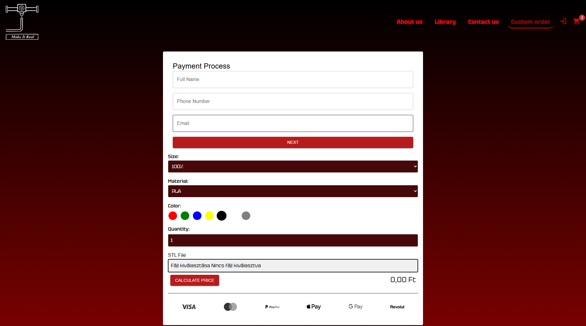
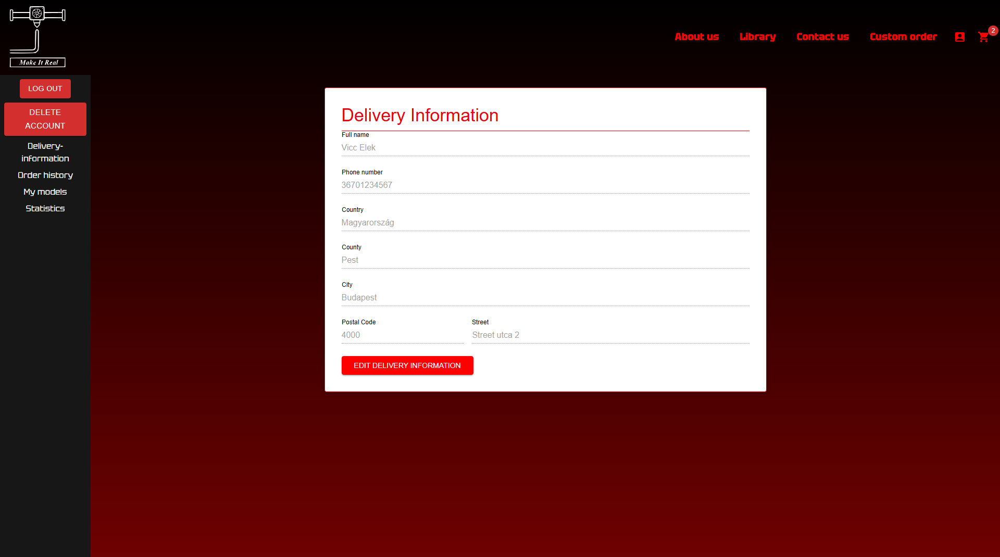

= Make It Real

== Introduction

Make It Real is a cloud based service,
where you can upload a model you want 3D printed,
or an idea of what you need. If you send a model
we print it for you and ship to you directly.
If you sent an idea, we make you a model based
on that, while asking you further questions about your needs,
and then send it to you. You can send your 3D model in .stl or in .step file format.

== The goal

The goal is to create an application that allows users to live out their creativity with 3D printable designs. If they don't want or don't have the resources to buy a 3D printer, we can give you a much cheaper solution to make your ideas come to life.

== Technical requirements

=== From the user's side

The only requirements from the user are a web browser, and Internet connection.

=== From the admin's side

For the backend to work properly you need to download Prusa Slicer, stl-thumb. The backend uses Prusa Slicer and stl-thumb to generate G-Code and product image.

== Software dependencies
* Node.js +
* React.js +
* SQLite +
* Prusa Slicer

Works on all operating systems

== Usage Instructions
=== Create account
You can create an account by clicking on the upper-right LOGIN icon, then you click on REGISTER. There you have to make a username, give your e-mail address, create a password and confirm it.

=== Login
If you already have an account, you can log in by typing in your credentials.

image::login.PNG[]

=== Sending a custom product
You can send us a model file (.stl) of the item you want to be printed. +
From there, we will contact you to get further information about your idea.

=== Uploading your model
If you send in your own design, we offer you the option of
sharing your design for others to order. This is beneficial for
you, because you get a percentage of every sell we make on your design.

=== Library
When you upload a design it is added to the library, so others can order it and you get a percentage after each sell.

=== Product
If you click on any product in the library it takes you to the product page.

image::product.PNG[]

=== Cart
When you decided you want the product, you can add it to the cart.

=== Checkout
After you are done with shopping you can finalize your order in the checkout section.

== Managing files

=== You can choose from different materials
* PLA +
* PETG +
* ABS

=== You can customise the size, the material, the quantity and the color.
image::product.PNG[]

== Profile

=== Delivery informations

Here you can see your delivery informations, so you can edit them if you move or want to edit it.

=== Order history

Here are the models you ordered in the past.

=== My models

Here are your previously uploaded models.

=== Statistics
Here are the total earnings from you models, the number of sales and your percentage from it.

== Contact information
link:mailto:info@makeitreal.com[makeitreal@info.com ] +
+36(69)324-04-45

